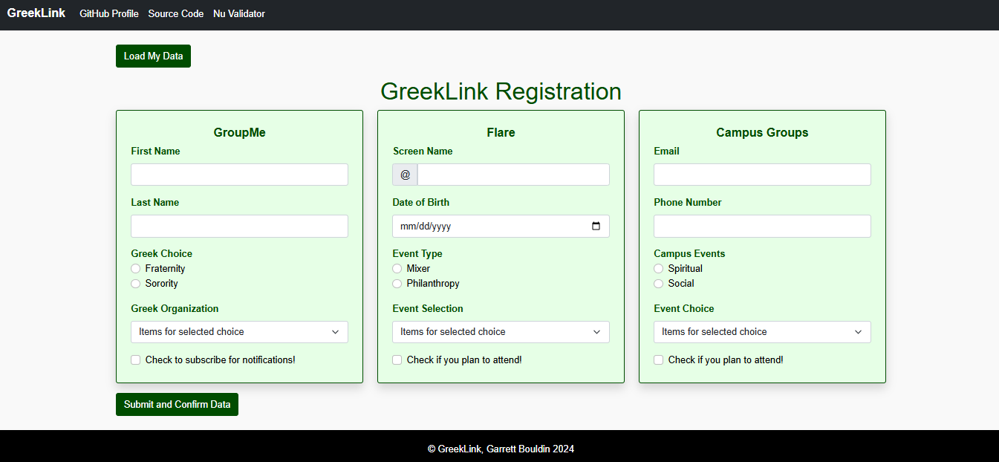

# GreekLink

### As a member of a fraternity

### I want to be able to access fraternity information in one central location

### So that I don't have to use multiple apps

## Main Goal
This project consists of creating a **mobile-responsive web application** designed to manage and edit data from three separate objects, `groupMe`, `flare`, and `campusGroups`, in one central location.

## Features  
* One webpage, or central location, that a fraternity or sorority member can go to for accessing, learning, or editing data related to fraternity and sorority life.  
* The load data button at the top left of the page allows a user to quickly load in their personal data to make learning about and registering for events easier. 
* Three separate cards (one for GroupMe, Flare, and CampusGroups respectively) in a form that are set up for a user to put in their information, learn about events, and register for the events they want to go to.
* Once the user is satisfied with the information they have put in, they can hit the submit and confirm information button at the bottom of the page. After clicking this button, the data they input will be logged to the console in JSON format and the user will receive a personalized message back saying that their data was collected successfully.
* The app is also styled with a **green, black, and white color scheme** as these are the official colors of GreekLink.

---

## Simple How to Use Guide
1. Open the app in a browser.  
2. Click the **Load Data** button to populate the cards with default  user data.  
3. Edit the values in the form fields as desired.  
4. Click **Submit** to save changes, receive a message stating that the data has been collected, and view the JSON output in the console.

---

## GreekLink Interface Preview 

---

## Credits
Created by Garrett Bouldin. Inspired by real-world scenarios in fraternity and sorotity life at the University of North Alabama.
